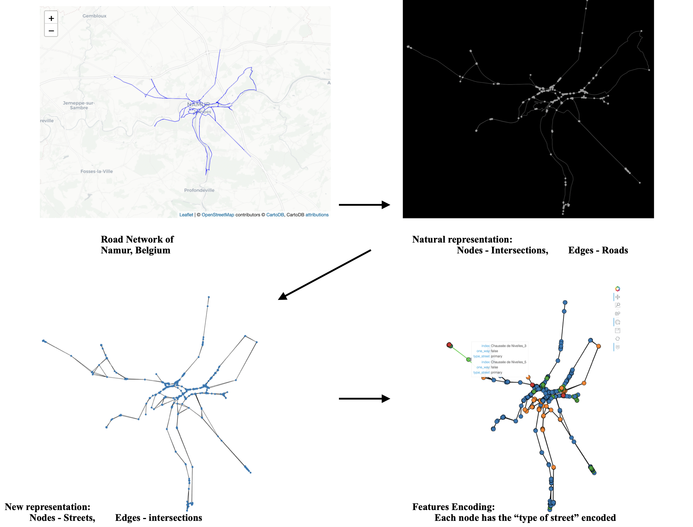

# Streamlit App


# Docker Image

## Build Image
To create an image first:

```{r}
git clone https://github.com/giobbu/ML-streamlit-apps
cd ML-streamlit-apps/road-traffic-graph 
```

Then run:
```{r}
docker build -t name-image .
```

Check the image created:
```{r}
ML-streamlit-apps/road-traffic-graph >>> docker image ls

REPOSITORY             TAG       IMAGE ID       CREATED          SIZE
giobbu/streets-graph   latest    a22bc4da76b4   26 minutes ago   2.97GB
```

## Pull Image from Docker Hub
To downloaded the image from Docker Hub:
```{r}
docker pull giobbu/streets-graph
```

## Run Streamlit App Container
To interact with the App type:
```{r}
docker run -p 8501:8501 --rm giobbu/streets-graph
```
view your Streamlit app in your browser
```{r}
localhost:8501
```

# How it works

Construct street network graph for GCN using OSM and OSMNX python package




